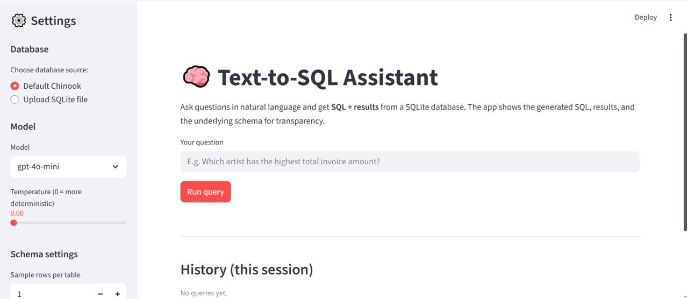
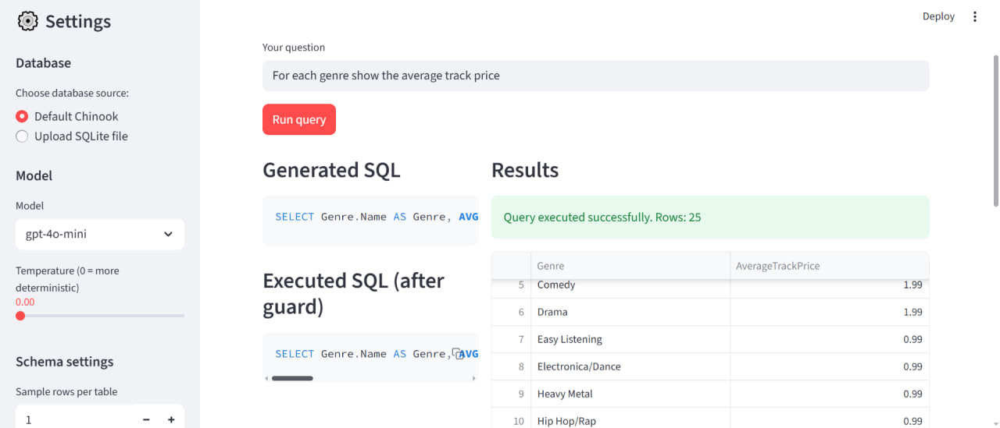
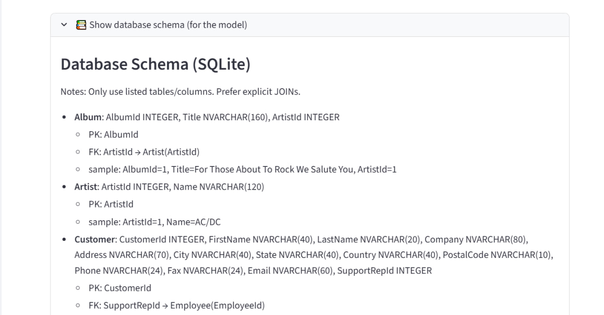
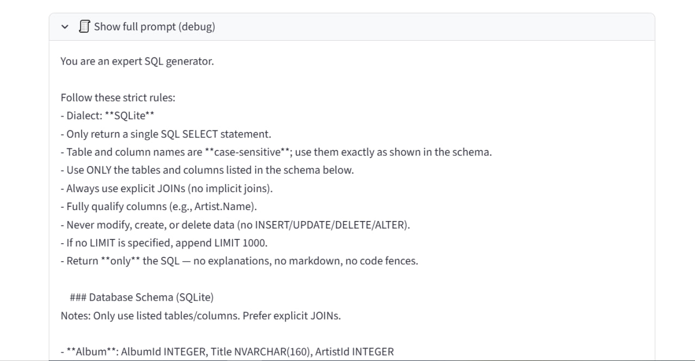
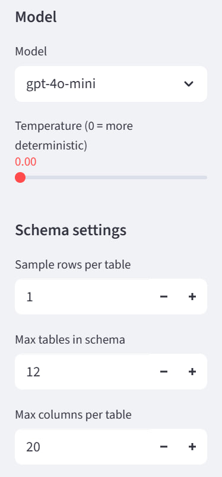

# 🚀 Text-to-SQL Assistant  
*A natural-language interface for querying relational databases using LLM-generated SQL.*



---

## 📖 Overview

**Text-to-SQL Assistant** enables users to ask questions in natural language and automatically converts them into safe, validated **SQLite SQL** queries with real-time results.

This system democratizes access to data by allowing anyone — technical or not — to query a database without writing SQL.

It provides **full transparency**, showing:
- Generated SQL  
- Executed SQL  
- Database schema  
- Full LLM prompt  
- Query results  
- Configurable settings sidebar  

This project is a **portfolio-grade, end-to-end LLM engineering system** covering data engineering, prompt engineering, safety, evaluation, and UI development.

---

# 🌟 Features

### ✔️ Natural language → SQL  
Translates English questions into valid SQL using OpenAI models (`gpt-4o-mini`, `gpt-4.1`, etc.).

### ✔️ Automatic schema ingestion  
Reads all tables, columns, and PK/FK relationships using SQLAlchemy reflection.

### ✔️ SQL safety guardrails  
- SELECT-only enforcement  
- Denylist: UPDATE, DELETE, INSERT, DROP, ALTER…  
- Auto-LIMIT if missing  
- Single-statement enforcement  
- Case-sensitive table/column validation  

### ✔️ Interactive Streamlit UI  
- Question input  
- Generated SQL  
- Executed SQL after guard  
- Download results as CSV  
- Collapsible schema & prompt  
- Model/temperature controls  

### ✔️ Fully transparent  
Shows everything the model sees and generates.

---

# 🧠 System Architecture

User question  
↓  
schema_reader → auto-ingests DB schema  
↓  
prompt_builder → rules + schema + examples + question  
↓  
LLMClient → OpenAI model generates SQL  
↓  
sql_guard → SELECT-only, denylist, LIMIT, validation  
↓  
safe_execute → SQLAlchemy execution  
↓  
Results table (+ CSV)

---

# 🖥️ Application UI

## 🖼️ Main Interface  


---

## 🔍 Example Query  


---

## 🗄️ Schema Viewer  


---

## 🧠 Full Prompt (Debug)  


---

## ⚙️ Settings Sidebar  


---

# 🗂️ Project Structure

text2sql-assistant/  
├── app/  
│   ├── __init__.py  
│   ├── schema_reader.py       # Reflects DB schema → dict + markdown  
│   ├── prompt_builder.py      # Builds full LLM prompt  
│   ├── llm_client.py          # OpenAI client wrapper  
│   ├── sql_guard.py           # SQL safety validation  
│   ├── db.py                  # SQLite engine + safe_execute  
│   ├── orchestrator.py        # CLI pipeline  
│   └── ui_streamlit.py        # Streamlit frontend  
│  
├── data/  
│   └── chinook.sqlite  
│  
├── evaluation/  
│   ├── qa_pairs.jsonl  
│   └── run_eval.py  
│  
├── tests/  
│   ├── test_schema_reader.py  
│   ├── test_prompt_builder.py  
│   ├── test_sql_guard.py  
│   └── test_pipeline.py  
│  
├── images/  
│   ├── ui_main.png  
│   ├── query_example.png  
│   ├── schema_view.png  
│   ├── full_prompt.png  
│   └── settings_sidebar.png  
│  
├── requirements.txt  
├── .env (ignored)  
└── README.md

---

# ⚙️ Installation & Setup

1. **Clone the repo**
```
git clone https://github.com/YOUR_USERNAME/text2sql-assistant.git
cd text2sql-assistant
```

2. **Create environment**
```
python -m venv .venv
.\.venv\Scripts\activate
pip install -r requirements.txt
```

3. **Add OpenAI API Key**

Create `.env`:
```
OPENAI_API_KEY=your_key_here
```

4. **Run the UI**
```
streamlit run app/ui_streamlit.py
```

---

# 📊 Evaluation

Run accuracy & execution tests:
```
python -m evaluation.run_eval --validate evaluation/qa_pairs.jsonl --db data/chinook.sqlite --sanity
```

Metrics include:
- Execution success rate  
- Exact SQL match  
- Result equivalence  

---

# 🔐 SQL Safety

The SQL guard ensures:
- SELECT-only queries  
- No modification queries  
- Auto LIMIT  
- No stacked statements  
- Schema-aware validation  

If SQL fails validation, the model is prompted to repair it safely.

---

# 💡 Example Questions to Try

- “Which artist has the most albums?”  
- “List the 10 most expensive tracks.”  
- “Show total sales by country.”  
- “Which customers spent the most money?”  
- “Top genres by number of tracks.”  
- “Monthly sales totals for 2010.”  

---

# 👩‍💻 Author
Akseniia Konashenkova Data Scientist LinkedIn: www.linkedin.com/in/akseniia-konashenkova
